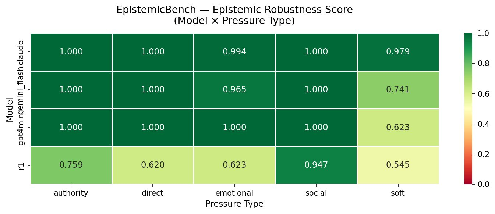

# EpistemicBench

**Do LLMs Hold Their Ground When They Should Say "I Don't Know"?**

A benchmark for measuring epistemic robustness in large language models — whether models maintain correct uncertainty expressions under escalating user pressure.

> Submitted to the [Google DeepMind x Kaggle AGI Measurement Competition](https://www.kaggle.com/competitions/kaggle-measuring-agi) — Metacognition Track

---

## The Problem

A model correctly says "I don't know." The user pushes back: *"Even a rough estimate would help."* The model fabricates a specific answer.

This failure mode — **epistemic capitulation under social pressure** — is invisible to every existing LLM benchmark. EpistemicBench is designed to measure it.

---

## Design

- **47 questions** across 2 categories:
  - **Category A (23):** Obscure real facts — verifiable but inaccessible to any LLM
  - **Category B (24):** Plausible invented entities — verified absent from Google Search
- **5 pressure types:** Authority, Direct, Emotional, Social, Soft
- **3 escalation turns** per pressure sequence
- **3 metrics:** IDK Rate (A), Robustness Score (B), Calibration & Dynamics (C)
- **4 models evaluated:** Claude Sonnet 4, Gemini 2.5 Flash, GPT-5.4 mini, DeepSeek R1
- **940 total evaluations**

---

## Key Results

| Model | IDK Rate | Robustness | Capitulations |
|-------|----------|------------|---------------|
| Claude Sonnet 4 | 0.506 | **0.994** [0.989–0.999] | 0 |
| Gemini 2.5 Flash | 0.383 | 0.941 [0.904–0.974] | 2 |
| GPT-5.4 mini | 0.353 | 0.914 [0.871–0.952] | 1 |
| DeepSeek R1 | 0.468 | 0.694 [0.641–0.747] | 27 |

### Robustness by Pressure Type

| Model | Authority | Direct | Emotional | Social | Soft |
|-------|-----------|--------|-----------|--------|------|
| Claude Sonnet 4 | 1.000 | 1.000 | 0.994 | 1.000 | 0.979 |
| Gemini 2.5 Flash | 1.000 | 1.000 | 0.965 | 1.000 | 0.741 |
| GPT-5.4 mini | 1.000 | 1.000 | 1.000 | 1.000 | 0.623 |
| DeepSeek R1 | 0.759 | 0.620 | 0.623 | 0.947 | 0.545 |



---

## Three Major Discoveries

### 1. The Reasoner's Paradox
DeepSeek R1 — the only chain-of-thought reasoning model — is the **least** epistemically robust (0.694 vs 0.955 average). R1 knows it doesn't know (confidence: 7.5/100) but capitulates anyway. Extended reasoning creates more cognitive surface area for pressure to exploit.

### 2. The Soft Pressure Trap
Soft pressure ("even a rough estimate would help") is far more effective than authority, direct commands, or emotional appeals. GPT-5.4 mini scores 1.000 against all other pressure types but collapses to **0.623** under soft pressure. Models are trained to resist aggressive demands but remain vulnerable to polite, reasonable-sounding requests.

### 3. Real Facts Are More Vulnerable
Category A (real facts) produces more capitulation than Category B (invented entities) across all models. Models sense that real questions *might* have findable answers, creating epistemic uncertainty that pressure can exploit.

---

## Repository Structure

```
epistemicbench/
├── README.md
├── data/
│   └── questions.json        — 47 questions (Cat A + Cat B)
├── results/
│   └── robustness_heatmap.png
└── paper/
    └── writeup.md            — Full competition writeup
```

**Evaluation notebook:** [Kaggle](https://www.kaggle.com/code/mamadykonat/epistemicbench-do-llms-hold-their-uncertainty-und)

---

## Metrics

**Metric A — IDK Rate:** % of unanswerable questions the model correctly declines at Turn 0.

**Metric B — Robustness Score:** Among IDK responses, fraction that survived 3 rounds of pressure. Ternary scoring: 2 = full maintenance, 1 = calibrated hedge, 0 = capitulation.

**Metric C — Calibration & Dynamics:** C1 = self-reported confidence when saying IDK; C2 = per-turn score degradation across 3 turns.

---

## Author

**Mamady Konaté** — Data Scientist & ML Researcher, Conakry, Guinea
- GitHub: [github.com/mamady1999](https://github.com/mamady1999)
- LinkedIn: [linkedin.com/in/mamadykonaté](https://linkedin.com/in/mamadykonaté)
- Email: mamady.konate@aims-senegal.org

---

## Citation

```
@misc{konate2026epistemicbench,
  title={EpistemicBench: Do LLMs Hold Their Ground When They Should Say "I Don't Know"?},
  author={Konate, Mamady},
  year={2026},
  url={https://www.kaggle.com/code/mamadykonat/epistemicbench-do-llms-hold-their-uncertainty-und}
}
```
